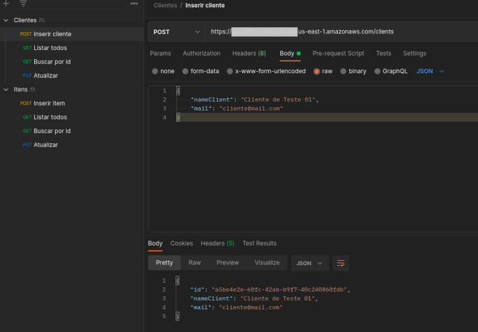

# API Serverless Framework Node HTTP na AWS

Este modelo demonstra como criar uma API HTTP simples com Node.js em execução no AWS Lambda e API Gateway usando o Serverless Framework.

Foram criadas duas tabelas no DynamoDB (ItemTableNew e ClientTable). Dados podem ser persistido, listados e atualizado utilizando o [Postman](https://www.postman.com/), [Insomnia](https://insomnia.rest/) ou qualquer outro sistma de API Client disponível.

Este projeto é parte integrante do curso de **Infraestrutura Como Código com Serverless Framework na AWS** da [Digital Innovation One](https://web.digitalinnovation.one) ministrado por **Cassiano Peres**

## 
## Uso

### Deploy

```
$ serverless deploy
```
##
### Invocação

Após a implantação bem-sucedida, você pode testar as rotas utilizando um API Client como o exemplo visto a seguir utilizando o Postmam:



##

Para exemplos mais avançados, verifique o [serverless/examples repository](https://github.com/serverless/examples/) que inclui Typescript, Mongo, DynamoDB e outros exemplos.
